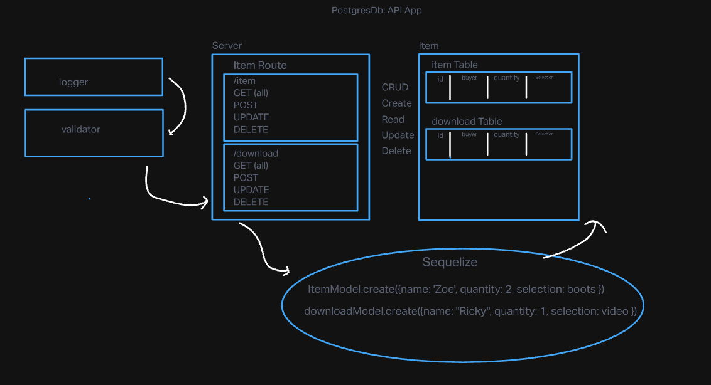

# basic-api-server
A basic api server for class

## Project: Basic API Server

## Author: Zoe Gonzalez

### Problem Domain: This application was created in order to help me understand CRUD and SQL database management, I created alternative but similar routes and implemented a router to enforce a strict but helpful managment tool in express as my project grows in complexity.

GitHub Actions: https://github.com/ZuSolaris/basic-api-server/actions

Production Deployment: https://dashboard.render.com/web/srv-ce4dslun6mpku7l83tm0/deploys/dep-ce4m3kun6mpj46gopbcg

### Setup

#### env requirements

see `.env.sample`

PORT: 3001 

DATABASE_URL:postgres://localhost:5432/sql-test?sslmode=disable

### How to initalize application

'npm start'

'nodemon'

'npm test'

#### How to use your library

-nodemon for starting

-npm test for testing

#### Features / Routes

/ : automatically redirects you to the page.

/bad: Sends you to an error page.

/item: Sends you to a general item directory with the selected name. 

/download: Sends you to a general download directory with the selected name. 

/* : If the page is not available then an error flag is thrown. 

